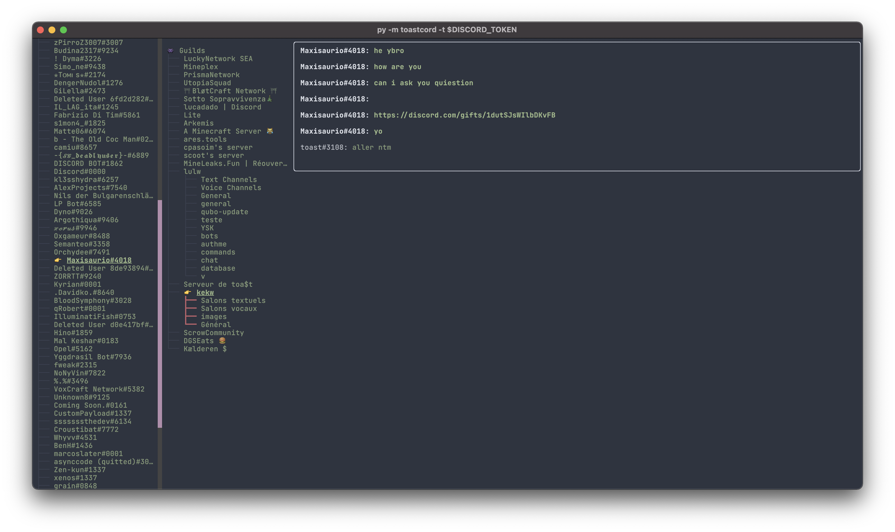
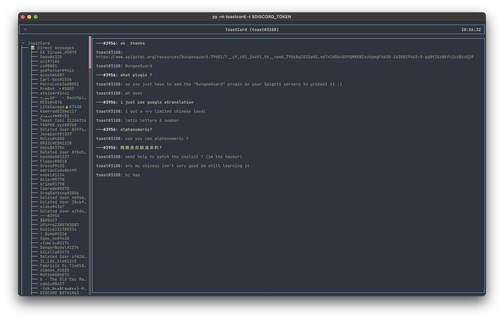
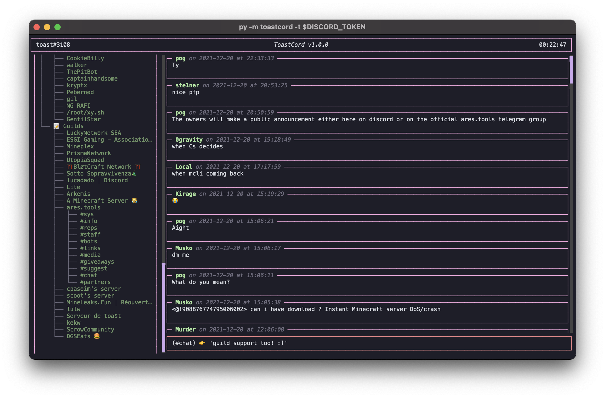

<h1 align="center">ToastCord</h1>
<i><h3 align="center">a Discord Terminal UI made in Python 3</h3></i>
 

⚠️ This is against the [Discord ToS](https://discord.com/terms)

### Getting started 😃

This only support UNIX based systems. If you are a Windows user you can still use Windows Subsystem for Linux (WSL) to run this. You can find the WSL [here](https://wsl.microsoft.com/)
Also, running this remotely (e.g. on a server as Cloud Shell) is not recommended.

- Clone the repo with `git clone https://github.com/traumatism/ToastCord`
- Install the requirements with `python3 -m pip install -r requirements.txt`
- (Optional) Export your token in your (bash/zsh)rc with `export DISCORD_TOKEN=<your token> >> ~/.bashrc`
- Run ToastCord with `python3 -m toastcord --token "$DISCORD_TOKEN"`

Needing help or having issues ? Message me on Discord: `toast#3108` !

### Features 📝

- Look messages through guilds channels & DMs
    - Switch through guilds, channels and DMs with mouse
- Send messages to guilds channels
- Send messages to users
- Keybinds
    - r  _Refresh the messages in the selected channel_
    - s  _Toggle the sidebar_
    - q  _Exit ToastCord_

### Coding Features ⚙️

- Custom API client for interacting with Discord
- Asynchronous __and__ synchronous HTTP clients

### Screenshots 👀

  

### TODO 🧩

- Add notifications
- Add profile lookup
- "Infinite" conversations loading (from the last message to the first, progressively)
- Move around with keyboard
- Complete scripting engine / external API using

👉 This is being updated, don't forget to `git fetch` and `git pull` regularly.